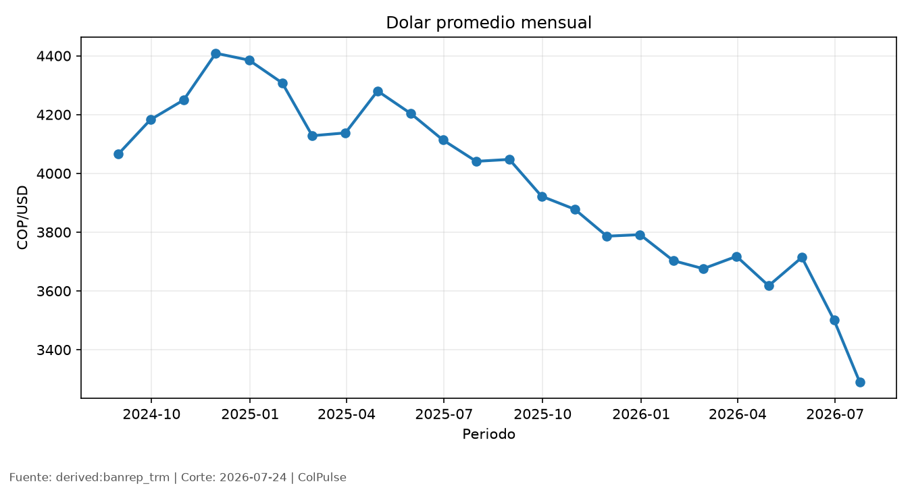

# ColPulse | Radiografia de 2026-07

**Executive summary**
El monitor consolida 40 indicadores oficiales de Colombia con datos disponibles hasta 2026-07-24. La base combina senales de precios, actividad, mercado laboral, sector externo, condiciones financieras y mercados. La lectura ejecutiva debe distinguir hechos observados, inferencias razonables e hipotesis pendientes de validacion; ningun resultado modelado se presenta como dato oficial.

## Insights clave

### Insight 1
El dolar subio: cerro en 3,219 pesos por dolar, con un cambio de 12 pesos por dolar frente al dato anterior.

### Insight 2
La tasa de politica monetaria se mantuvo estable: cerro en 12.00%, con un cambio de 0.00% frente al dato anterior.

### Insight 3
El COLCAP subio: cerro en 2,311.70 puntos, con un cambio de 172.57 puntos frente al dato anterior.

## Grafico principal

## Estado de datos
La trazabilidad de esta corrida queda en [data_health.md](data_health.md). Los indicadores con estado no publicable no se usan para conclusiones ejecutivas.

**Dato de cierre:** El proximo corte debe vigilar frescura de fuentes y revisiones oficiales.
